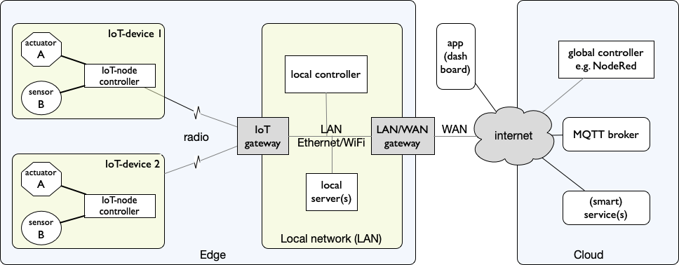

Inleiding
---------

    IoT-keten met verbindingen en verbindingsapparaten

Hierboven zie je de IoT-keten met verbindingen en verbindingsapparaten:

* de *IoT-radioverbinding* verbindt de IoT-knoop met de *IoT-gateway*;
* de *IoT-gateway* verbindit dit draadloze IoT-netwerk met het lokale netwerk (LAN);
* de *LAN/WAN (lokale) gateway* verbindt het lokale netwerk (LAN) met het internet
  - via het wide-area netwerk (WAN) van de internet service provider (ISP);
* de *MQTT-broker* zorgt voor de MQTT-communicatie tussen de IoT-knopen,
  de controllers en de apps in het publieke internet;

In deze figuur zijn ook de verbindingen getekend:

* de IoT-radioverbinding tussen IoT-knoop en IoT-gateway;
* het lokale netwerk (LAN), met daarin de lokale controller;
* het publieke internet - verbonden via het wide area network (WAN) van de internet service provider;
* met daaraan verbonden de MQTT broker, de globale controller, de app(s) en de diensten (in de "cloud").

Deze verbindingen zijn voor een deel bedraad, bijvoorbeeld als Ethernet of glasvezel-verbindingen.
Draadloze (radio)verbindingen vind je in het IoT-netwerk,
in het lokale netwerk (WiFi), en in het mobiele internet voor de smartphone.

De keten is opgebouwd uit een lokaal deel, de *edge*, dichtbij de IoT-knopen;
en een deel op afstand in grote servercentra (de *cloud*).
Daar vind je de MQTT-broker, de globale controller en de diensten.
